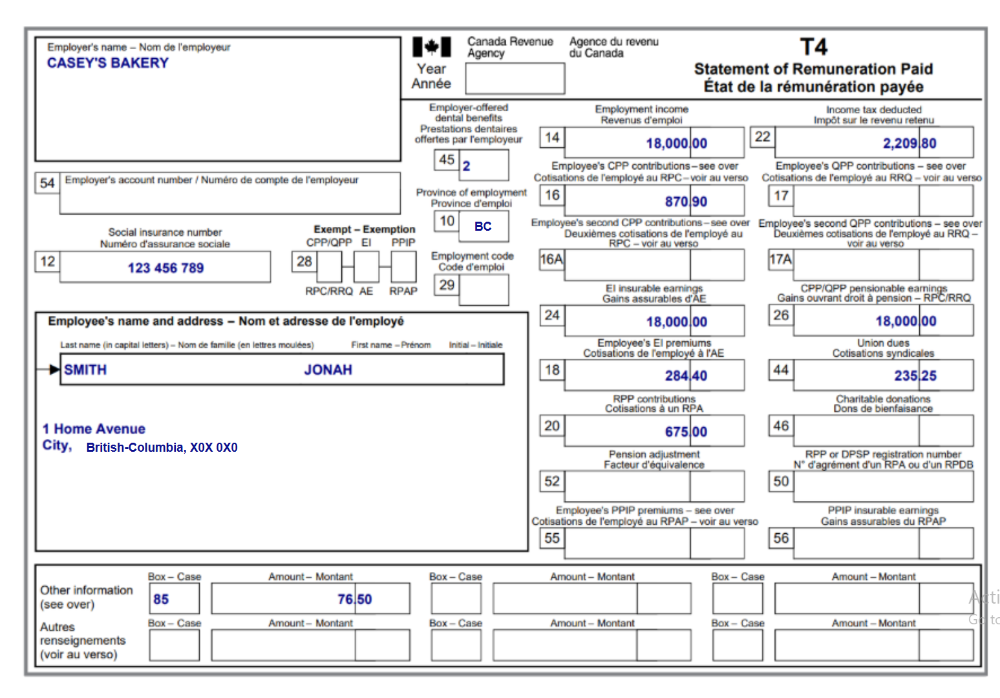

# Exercice de groupe : Jonah travaille et paye un loyer

Si ce n'est pas déjà fait, merci de [créer un compte sur Wealthsimple](https://my.wealthsimple.com/app/public/signup/){:target="_blank"}.

**Contexte: Jonah à vécu en Colombie-Britannique pour l'entièreté de 2024 et paye un loyer de 900$/mois à son propriétaire, John Smith.**

**Remplir la déclaration de Jonah**

1.  Remplir les informations requises dans la section "About you" basé sur les informations de Jonah disponible sur son T4. Dans le contexte de cet exercice, Jonah est célibataire et est citoyen canadien et n'a pas investi dans des propriétés dans les dernières années. 

2.  Rechercher les formulaires nécessaires pour la déclaration dans la section "Manage tax forms".
   - Ceci inclu le T4 ainsi que le crédit de la C.-B. pour les locataires (British Columbia Renter's Tax Credit).

3. Remplir les lignes nécessaire pour les formulaires que tu viens d'ajouter. Seuls les informations se trouvant sur le document officiel doivent être remplis. **Il *ne faut pas* ajouter de "0" dans les cases vide.**
   
4. Vérifie que le document n'a pas d'erreurs (pour cet exercice, puisque les données personelles sont fictives il y aura des erreurs (indiqué en rouge), cela est correcte pour l'exercice mais ne devrait pas être le cas lorsque tu fait ta propore déclaration d'impôt.)
   
5. Regarde le résumé, les détails de la déclaration sont ici.
   - **"Balance Owing" signifie que Jonah doit payé de l'argent à l'ARC.** Ceci peut être fait à partir de ton compte de l'ARC.
   - **"Refund" signifie que Jonah va recevoir un remboursement de l'ARC.** Wealthsimple ne permet pas d'ajouter les informations de dépot direct dans la déclaration (certains programmes permettent d'ajouter cet information directement dans la déclaration), l'information doit doc être ajouter ou mise à jour à partir de ton compte de l'ARC. Si aucune information de dépot direct n'est soumise, le remboursement sera envoyé par chèque. 
  
6. Pour une vrai déclaration, on clique ensuite sur "Submit" afin de soummettre la déclaration d'impôt complèter. Un numéro de confirmation serait alors généré et sert de preuve que la déclaration est bien soumise. 

  
**Félicitation, tu peux maintenant choisir quel activité supplémentaire tu veux pratiquer!** Rappel toi que tu peux faire plusieurs simulations et que choisir toutes les options qui s'appliquent à ta situation va mieux te préparer. 

**N'oubli pas de prendre une capture d'écrant de ton travail après avoir complèter l'exercice afin de validé ton devoir pour l'atelier d'aujourd'hui!**

<script>  

[NEXT STEP: RStudio Integration](Ex.1.html){: .btn .btn-blue }
