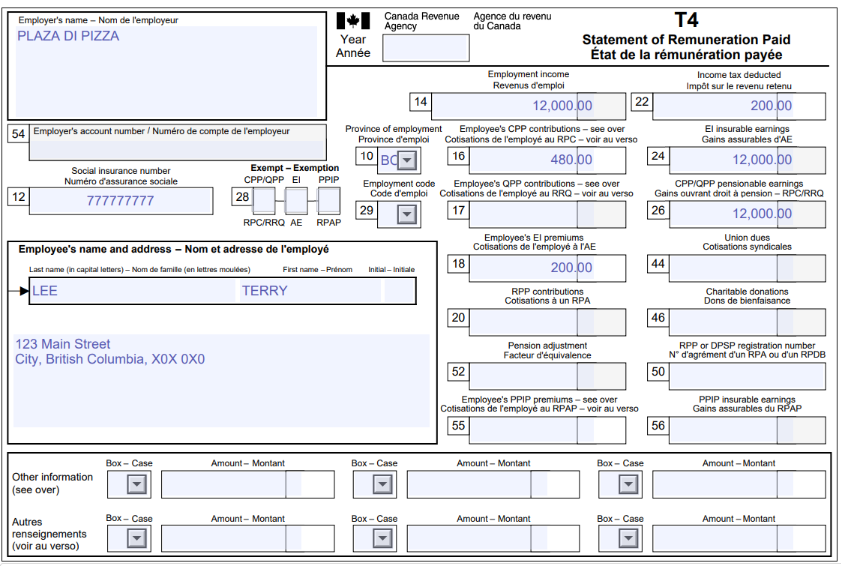

# Exercice 1 : Terry est un nouvel arrivant au Canada

Si ce n'est pas déjà fait, merci de [créer un compte sur Wealthsimple](https://my.wealthsimple.com/app/public/signup/){:target="_blank"}.

**Contexte: Terry est un nouvel arrivant au Canada, il à déménager en Colombie-Britannique le 8 juin 2024 et demeurait précedement en Jordanie. Il fait sa première déclaration d'impôt avec l'ARC et n'a pas eux de revenue Canadien avant son arrivé au Canada. Entre janvier et juin 2024, donc avant son déménagement, Terry à gagné environ 771.02 JD (dinar jordanien) soit environ 1500$ CAD (dollars canadiens) en Jordanie.**

**Remplir la déclaration de Terry**

1.  Remplir les informations requises dans la section "About you" basé sur les informations de Terry disponible sur son T4 et dans le contexte.
   
2.  Puisque Terry est un nouvel arrivant au Canada, il faut répondre "non" à la question "Were you a Canadian resident for all of 2024?" dans la section "About your Residency". Cela ferra apparaitrent les questions de suivi suivantes.

NB: Puisque Terry n'as pas été un résident de la C.-B. pour la totalité de 2024, il n'est pas admissible au crédit provincial pour les locataires (même si il est un locataire) que nous avons vue dans l'exercice de groupe. 

3.  Rechercher les formulaires nécessaires pour la déclaration dans la section "Manage tax forms".
   - Pour cet exercice cela est uniquement le T4.

4. Remplir les lignes nécessaire pour les formulaires que tu viens d'ajouter. Seuls les informations se trouvant sur le document officiel doivent être remplis. **Il *ne faut pas* ajouter de "0" dans les cases vide.**

5. Vérifie que le document n'a pas d'erreurs (pour cet exercice, puisque les données personelles sont fictives il y aura des erreurs (indiqué en rouge), cela est correcte pour l'exercice mais ne devrait pas être le cas lorsque tu fait ta propore déclaration d'impôt.)
   
6. Regarde le résumé, les détails de la déclaration sont ici.
     - "Balance Owing" signifie que Terry doit payé de l'argent à l'ARC.
     - "Refund" signifie que Terry va recevoir un remboursement de l'ARC.

7. Fait une capture d'écran pour démontré que tu as bien terminer l'exercice. **Le résultat finale pour Terry devrait être un remboursement de 124$**

