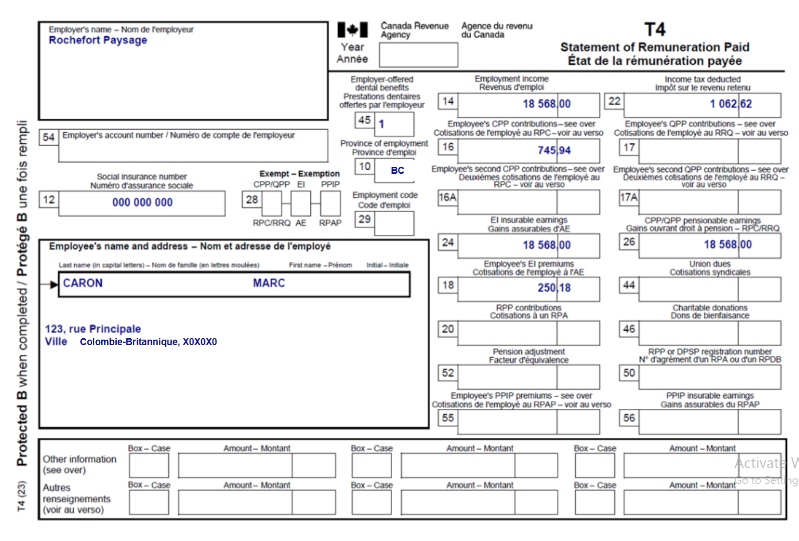
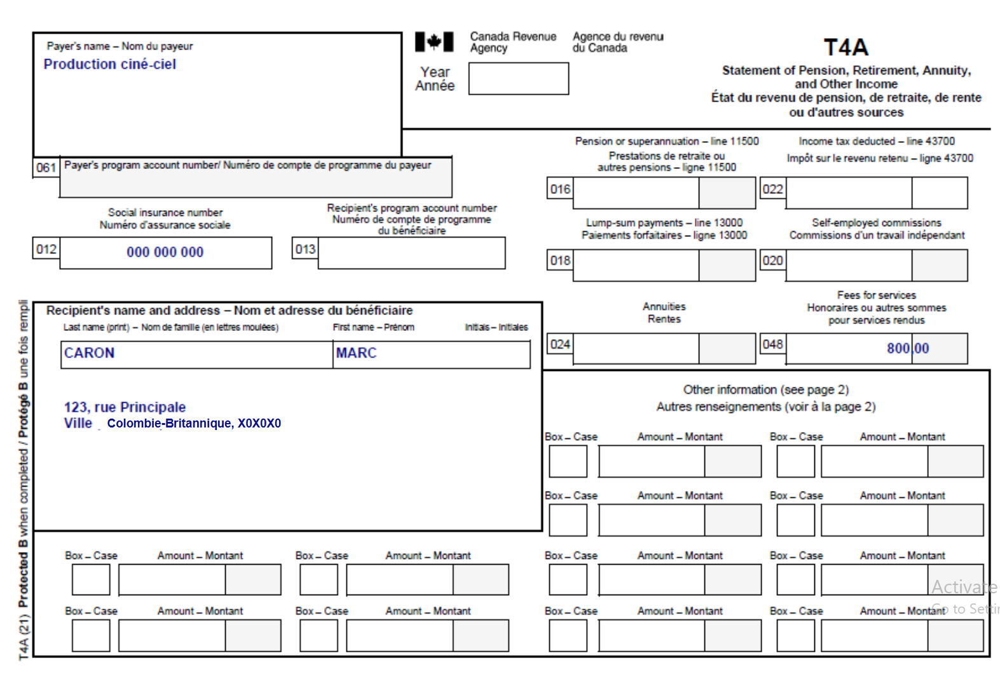
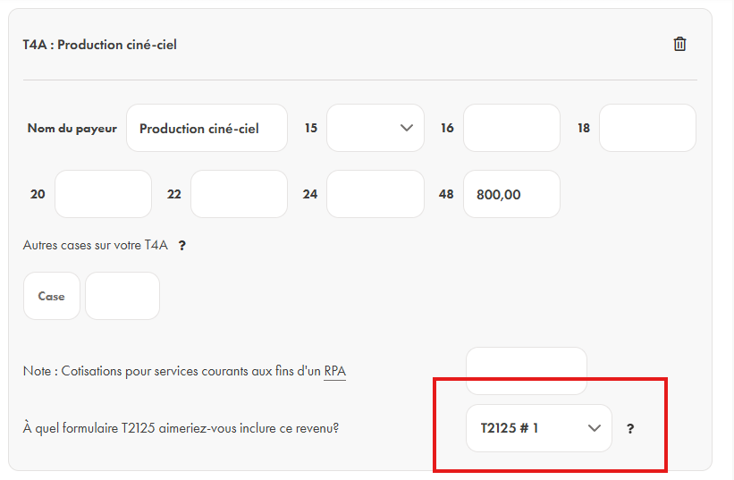
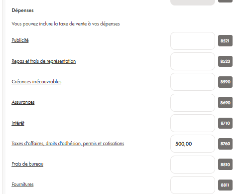

# Exercice 2 : Marc est salarié et supplémente son revenue en fesant du travial autonome. 

Si ce n'est pas déjà fait, merci de [créer un compte sur Wealthsimple](https://my.wealthsimple.com/app/public/signup/){:target="_blank"}.

**Contexte: Marc est salarié avec une compagnie d'aménagement paysager et supplémente son revenue en travaillant à son compte (freelance) dans le domaine de l'édition de vidéo. Il est donc travailleur indépendant et dois remplir un formulaire additionel sur sa déclaration d'impôt.**

Voici les informations que tu dois connaitre sur le travail autonome de Marc: 
- L'industrie dans laquelle Marc fait sont travail de freelance est un rôle de Classification nationale des professions (CNP ou NOC en anglais) 51110.
- La période fiscale pour l'entreprise personelle de Marc est du 1er janvier au 31 décembre annuellement.
- Marc veut déclarer une dépense de travail de 500$ pour son abonnement à un programme technologique (software) lié à son entreprise. Il a un reçu pour cette dépense.

**Remplir la déclaration de Marc**

1.  Remplir les informations requises dans la section "About you" basé sur les informations de Terry disponible sur son T4 et dans le contexte.
   
2.  Rechercher les formulaires nécessaires pour la déclaration dans la section “Manage tax forms”.
Pour cet exercice cela inclu:
-  Le T4;
-  Le T4A et;
  

-  Le T2125 (pas nécessaire de rechercher le formulaire, celui-ci s'ajoutera automatiquement).

4. Remplir les lignes nécessaire pour les formulaires que tu viens d’ajouter. Seuls les informations se trouvant sur le document officiel doivent être remplis. Il ne faut pas ajouter de “0” dans les cases vide.
   
5. Voyons comment remplir le T2125 de Marc.

Puisque Marc fait du freelance mais n'a pas de compagnie enregistré, le nom de son entreprise est le même que son nom légal complet (cela est standard).

Les dépenses d'entreprises sont une déduction d'impôt pour Marc (cela réduit le montant d'argent dû au gouvernement). 

6. Vérifie que le document n’a pas d’erreurs (pour cet exercice, puisque les données personelles sont fictives il y aura des erreurs (indiqué en rouge), cela est correcte pour l’exercice mais ne devrait pas être le cas lorsque tu fait ta propore déclaration d’impôt.)

7. Regarde le résumé, les détails de la déclaration sont ici.
“Balance Owing” signifie que Marc doit payé de l’argent à l’ARC.
“Refund” signifie que Marc va recevoir un remboursement de l’ARC.
Fait une capture d’écran pour démontré que tu as bien terminer l’exercice. **Le résultat finale pour Marc devrait être un remboursement de 924$.**

Notez bien: Lorsque l'on inclu des dépenses dans sa déclaration d'impôt, comme les dépenses médicales ou les dépenses d'entreprise, il est important de garder les reçus associés à ces dépenses pour une période de 7 ans, en cas d'audit. 
