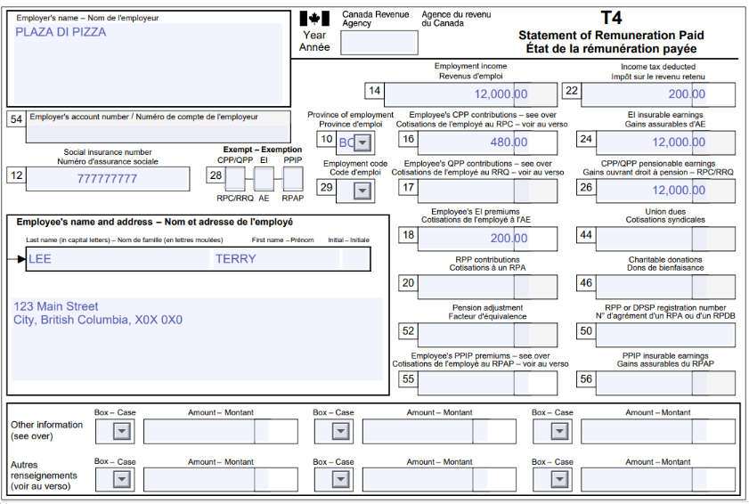

# Exercice 3 : Corrine travaille et à des dépendants à sa charge.

Si ce n'est pas déjà fait, merci de [créer un compte sur Wealthsimple](https://my.wealthsimple.com/app/public/signup/){:target="_blank"}.

**Contexte: Corrine travaille comme salarié et à deux jeunes enfants à sa charge. Elle a des dépenses liés à la garde de ces enfants.**

Voici les informations que tu dois connaitre sur les enfants de Corrine: 
- Aucun des enfants de Corrine n'a de handicap ou de NAS.
- Rose est née le 9 mars, 2021
- Rémi est née le 1er février, 2023
- Les deux enfants n'ont pas été à des écoles d'internat ou des camps du jour au lendemain (Boarding school or overnight camp).

**Remplir la déclaration de Corinne**

1.  Remplir les informations requises dans la section "About you" basé sur les informations de Terry disponible sur son T4 et dans le contexte.
   
2.  Rechercher les formulaires nécessaires pour la déclaration dans la section “Manage tax forms”.
Pour cet exercice cela inclu:
-  Le T4;
-  Le T4A et;
-  Le T2125 (pas nécessaire de rechercher le formulaire, celui-ci s'ajoutera automatiquement).

4. Remplir les lignes nécessaire pour les formulaires que tu viens d’ajouter. Seuls les informations se trouvant sur le document officiel doivent être remplis. Il ne faut pas ajouter de “0” dans les cases vide.
   
5. Voyons comment remplir le T2125 de Marc.

Puisque Marc fait du freelance mais n'a pas de compagnie enregistré, le nom de son entreprise est le même que son nom légal complet (cela est standard).

Les dépenses d'entreprises sont une déduction d'impôt pour Marc (cela réduit le montant d'argent dû au gouvernement). 

6. Vérifie que le document n’a pas d’erreurs (pour cet exercice, puisque les données personelles sont fictives il y aura des erreurs (indiqué en rouge), cela est correcte pour l’exercice mais ne devrait pas être le cas lorsque tu fait ta propore déclaration d’impôt.)

