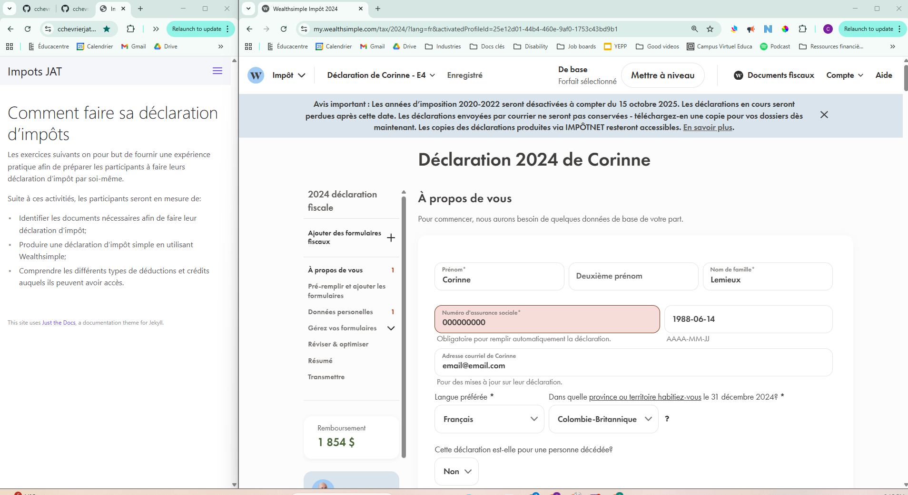

# Créer un compte Wealthsimple

Afin de faire les exercices, il est essentiel de te [créer un compte sur Wealthsimple](https://my.wealthsimple.com/app/public/signup/){:target="_blank"}. 

Tous les exercices:
- Utilisent la version 2024 de Wealthsimple

Et assument que les personnes inclues dans la déclaration d'impôt:
- Habitent en Colombie-Britannique;
- N'ont pas de vendu de résidence principale, ouvert un Compte d'épargne libre d'impôt pour l'achat d'une première propriété, ou flipper une résidence;
- Sont célibataires et le status marital n'a pas changé au cours de l'année d'impôt;
- Ne sont pas autochtone selon la définition de la Loi sur les Indiens;
- Ne possèdent pas des biens étrangés ayant une valeur de plus de 100 000$ CAD.
_- La date de naissance peut être inventé pour chaque déclarant, choisi une date avant 2000._

Pour te faciliter la tâche, il est recommender de redimentionner les fenêtre d'exercises, pour voir des instructions, [consulté ce tutoriel](https://www.youtube.com/watch?v=eVej-2NuY5o){:target="_blank"}.

Pour compléter le devoir, il faut faire des captures d'écrant, si tu ne sais pas comment faire, regarde le tutoriel [pour Windows](https://www.youtube.com/watch?v=eVej-2NuY5o){:target="_blank"} et [pour Mac](https://www.youtube.com/watch?v=dnmQ9EbC99Q){:target="_blank"}

**Tu es maintenant prêt à faire les simulations de déclaration d'impôts.**
